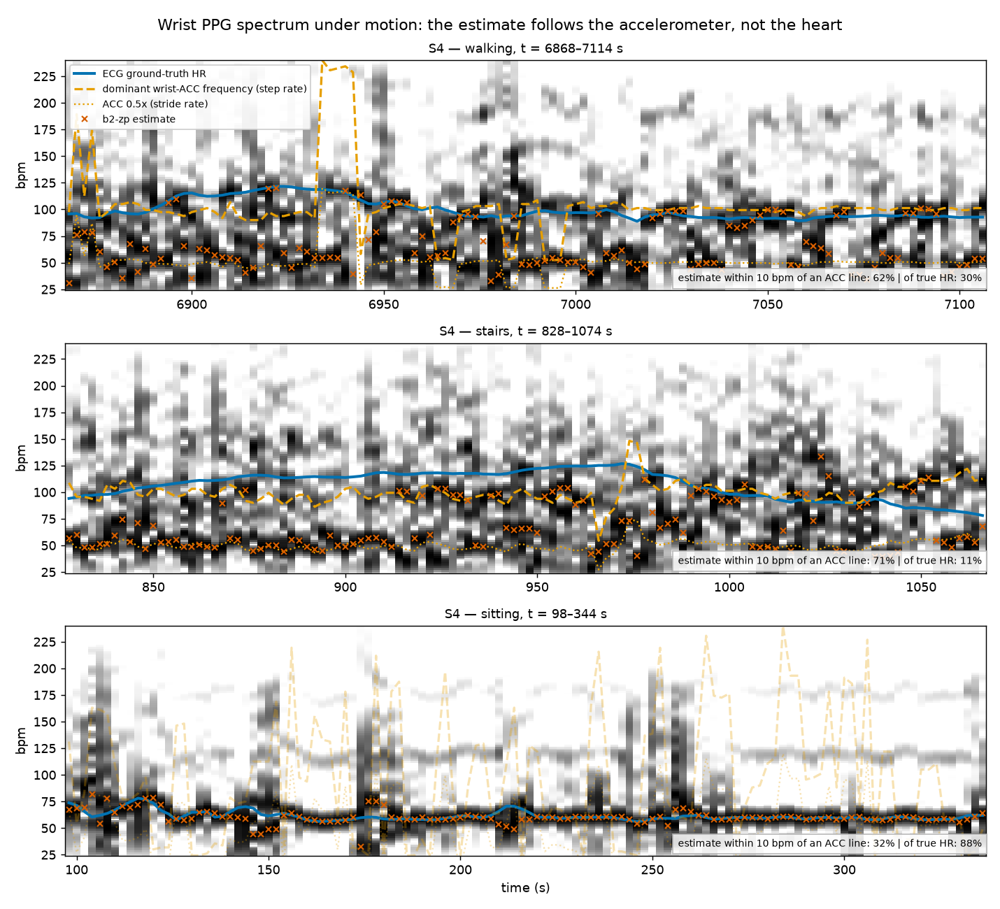
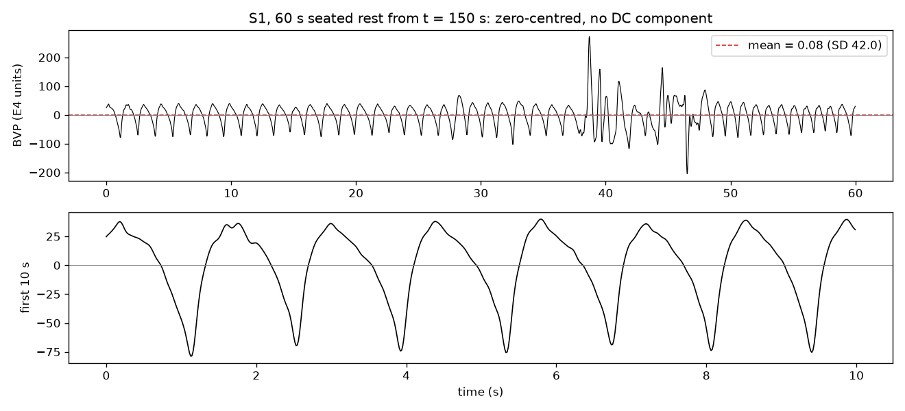
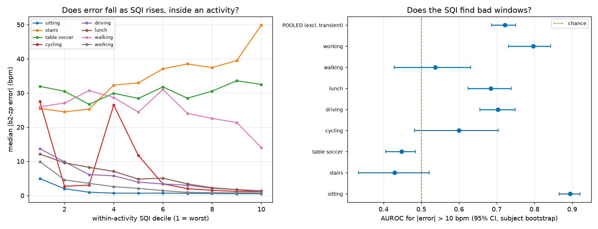

# wrist-ppg-motion-robust-hr

Heart-rate estimation from wrist PPG during real-world movement on PPG-DaLiA, with accelerometer-informed motion compensation. It is evaluated leave-one-subject-out, per activity, with baselines reported first.



*Band-passed wrist-PPG spectrum over the estimator's own 8 s windows for S4, with the ECG ground-truth heart rate (solid), the naive spectral-peak estimate (crosses) and the dominant wrist-accelerometer frequency with its stride subharmonic (dashed, dotted). During stairs the estimate sits on an accelerometer line in 71% of windows and on the true heart rate in 11%, while at rest it tracks the heart rate in 88% — the estimator is following the motion, not the heart. S4 was selected by rule: its stairs MAE is the closest of the 15 subjects to the cohort median.*

**Result.** Accelerometer-informed spectral masking plus peak tracking cuts heart-rate error on PPG-DaLiA from **18.98 to 15.80 bpm** MAE, leave-one-subject-out over 64,697 windows — matching the published SpaMa baseline (15.56) and short of SpaMaPlus (11.06). Masking removes the failure it targets: accelerometer lock falls from 23.3% of error windows to 13.1%, the chance rate. The method is much **worse** than the baseline on stairs and cycling, which the per-activity table below shows rather than hides.

**Status:** Stages 0–4 are done — validated data layer, label-aligned windowing, band-pass with signal quality, four LOSO baselines, and motion compensation by spectral masking and peak tracking. Adaptive cancellation (4b) is implemented and tested but not yet evaluated; see [docs/decisions.md](docs/decisions.md).

Design decisions and the evidence behind each: [docs/decisions.md](docs/decisions.md).

## Data layer (Stage 0)

`src/data/loader.py` loads each subject into a validated `SubjectRecord` and caches it. It raises on anything the pipeline assumes and does not hold: missing keys, channels whose durations disagree by even one sample, a label count that doesn't match 8 s windows at a 2 s shift, accelerometer data not in g, non-constant "dummy" channels, or out-of-order R-peaks. Nothing is silently coerced; the single tolerated irregularity (exact duplicate R-peaks in S6 and S14) is counted on the record.

Several facts checked against the files differ from the dataset's own documentation. The most consequential is that **wrist ACC in the pickle is already in g**; applying the readme's 1/64 g scaling would silently break motion compensation. The full list is in [data/README.md](data/README.md).



**The E4 BVP has no DC component.** A minute of seated rest from S1 has mean 0.084 against SD 41.95 (whole record: mean −0.002), so the signal is manufacturer-processed and zero-centred and **perfusion index is not available** as a quality measure. The segment also shows a motion burst around 38–47 s during nominal rest.

## Windowing (Stage 1)

`src/data/windows.py` cuts each subject into 8 s windows at a 2 s shift: 512 BVP samples and 256 wrist-ACC samples per window, with the ground-truth HR, the modal activity id and the skin type attached. Windows are produced by striding rather than copying, so a full subject costs no extra memory until materialised.

The assertion that matters is that **the window count equals `len(label)` exactly, for all 15 subjects**, and it is tested across the whole dataset. An off-by-one here would shift every downstream result invisibly. Five subjects (S2, S3, S5, S7, S15) have odd-length records, so a tail shorter than one 2 s shift is left unused; the test allows that and nothing else.

## Preprocessing (Stage 2)

`src/features/preprocess.py`: 0.4–4 Hz (24–240 bpm) 4th-order Butterworth, zero-phase via `sosfiltfilt`, then per-window z-scoring, plus a per-window signal-quality index.

Two implementation choices, both deliberate:
- **The continuous record is filtered before windowing.** `filtfilt` on an isolated 8 s window leaves edge transients at a 0.4 Hz cutoff. The windowing grid is unchanged.
- **Wrist ACC is resampled 32 → 64 Hz** (polyphase) so it shares a time base with the BVP, which time-domain adaptive cancellation needs in Stage 4. The original 32 Hz windows remain available.

The wide band is kept deliberately. Measured gain is 1.00 up to 150 bpm, 0.96 at 180, 0.80 at 210 and 0.50 at the 4 Hz corner, because zero-phase filtering applies the response twice. A 0.8–2.5 Hz band would pass only 0.07 at 180 bpm, discarding the stairs and cycling regime. In this dataset only 39 of 64,697 labels (0.06%) exceed 180 bpm, maximum 187, so the roll-off costs nothing here.

**Signal quality index** per window, from three components: mean correlation of each beat with the window's own beat template, spectral concentration around the dominant in-band peak, and the fraction of power outside the cardiac band (measured on the unfiltered window). Perfusion index is unavailable, as the BVP has no DC component.

**The composite is spectral concentration alone.** The beat-template term was dropped after validating it against error (below): the composite without it scores AUROC 0.722 for finding bad windows, inside the full composite's 95% CI of [0.69, 0.76]. A term that adds nothing measurable does not stay. It is still computed and reported as a component.

Mean SQI by activity, all 15 subjects, window-weighted — **descriptive only**, since motion lowers SQI and raises error, so this ordering would appear whether or not the SQI said anything about an individual window (`results/02_sqi_by_activity.csv`):

| Activity | Windows | SQI | Template r | Out-of-band |
|---|---|---|---|---|
| sitting | 4,569 | **0.739** | 0.855 | 0.055 |
| working | 8,497 | 0.625 | 0.857 | 0.084 |
| driving | 6,843 | 0.573 | 0.848 | 0.110 |
| lunch | 13,554 | 0.572 | 0.832 | 0.114 |
| cycling | 3,473 | 0.542 | 0.851 | 0.086 |
| table soccer | 2,310 | 0.488 | 0.810 | 0.135 |
| walking | 4,697 | **0.483** | 0.801 | 0.087 |
| stairs | 3,239 | **0.474** | 0.819 | 0.088 |

### Does the SQI predict error?

The real test is *within* an activity. Below: AUROC for detecting a b2-zp error above 10 bpm, oriented so higher means worse, with 95% CIs from bootstrapping **subjects** rather than windows — windows within a subject are correlated, and resampling them would understate the interval (`results/sqi_validation.csv`).



| Activity | AUROC [95% CI] | Median error, worst vs best SQI decile | Verdict |
|---|---|---|---|
| sitting | 0.895 [0.87, 0.92] | 5.0 → 0.5 | predictive |
| working | 0.797 [0.73, 0.84] | 9.9 → 0.7 | predictive |
| driving | 0.703 [0.65, 0.75] | 13.7 → 1.4 | predictive |
| lunch | 0.685 [0.62, 0.74] | 12.1 → 1.1 | predictive |
| cycling | 0.600 [0.48, 0.70] | 27.5 → 1.1 | **CI includes chance** |
| walking | 0.537 [0.43, 0.63] | 26.0 → 14.1 | **CI includes chance** |
| stairs | 0.429 [0.33, 0.52] | 25.5 → 49.9 | **CI includes chance** |
| table soccer | 0.448 [0.41, 0.48] | 32.0 → 32.5 | **anti-predictive** |
| **Pooled** (excl. transient) | 0.722 [0.69, 0.75] | — | predictive |

**The SQI works where there is little motion and fails where there is a lot** — which is the opposite of where a tracker would want it. In stairs, cycling and walking the CI includes 0.5, so it does not discriminate. In table soccer it is worse than useless: AUROC 0.448 with a CI entirely below 0.5, meaning higher SQI goes with *larger* error, and on stairs the worst-to-best decile trend runs the wrong way (25.5 → 49.9 bpm). The reason is that a motion-locked window can have a very sharp spectral peak — at the stride frequency. Concentration measures peak sharpness, not whether the peak is the heart.

**Consequence for Stage 4:** the peak tracker must not use SQI-triggered resets in stairs, table soccer, cycling or walking. Since activity labels will not exist at inference time, the reset rule needs a motion-aware quality term (e.g. agreement between the PPG peak and the accelerometer spectrum), not this SQI. No threshold has been tuned here; if one is needed it is chosen inside each LOSO fold on training subjects only.

## Baselines (Stage 3)

Four baselines, leave-one-subject-out over 15 folds, before any motion handling. Anything a method needs beyond the test subject's own signal — b0's constant, b1's first-window fallback — comes from that fold's training subjects only.

**Aggregation.** The MAE column below is the **mean of per-fold MAEs**: each subject contributes once, so a long recording does not outweigh a short one. The window-pooled figure is reported beside it in the CSV as `mae_pooled` (and `mape_pooled`); the two agree closely (they differ by at most 2.4 bpm, on the smallest cell — `b2_noclip` table soccer — and by under 1.1 bpm on every other row). Every cell carries its fold count — S6 has no lunch, walking or working, so those rows have 14 folds.

**Relative error.** MAPE is reported alongside MAE, because a 5 bpm error means something different at 60 and at 160 bpm. It is the same framing as MARD for glucose sensors, and it matters here: the subject with the worst MAE is far less extreme in MAPE.

| Activity | Folds | Windows | b0 mean HR | b1 *(oracle)* | b2 peak | **b2-zp** | b2-zp MAPE |
|---|---|---|---|---|---|---|---|
| sitting | 15 | 4,569 | 29.28 | 1.09 | 3.90 | **2.82** | 4.5% |
| stairs | 15 | 3,239 | 30.95 | 1.12 | 39.32 | **38.17** | 31.6% |
| table soccer | 15 | 2,310 | 14.02 | 1.85 | 33.54 | **33.27** | 34.9% |
| cycling | 15 | 3,473 | 33.74 | 0.96 | 30.96 | **29.75** | 23.4% |
| driving | 15 | 6,843 | 14.11 | 1.71 | 14.96 | **13.42** | 15.3% |
| lunch | 14 | 13,554 | 13.70 | 1.71 | 15.50 | **14.26** | 16.4% |
| walking | 14 | 4,697 | 15.46 | 1.25 | 29.66 | **29.61** | 28.6% |
| working | 14 | 8,497 | 17.02 | 1.40 | 9.89 | **8.62** | 10.3% |
| **Pooled, transients included** | 15 | 64,697 | 18.57 | 1.49 | 20.06 | **18.98** | 19.2% |
| **Pooled, transients excluded** | 15 | 47,182 | 19.12 | 1.46 | 18.49 | **17.35** | 17.6% |

MAE in bpm. Transient windows are 17,515 of 64,697 (27%), so both pooled figures are given. b1 uses ground truth and is an oracle reference, not a deployable method; pooled at 1.49 bpm, it shows how much of this task is pure temporal smoothness. Full tables — pooled and fold-mean MAE, MAPE, RMSE, per-fold spread, worst fold — are in `results/baselines_per_activity.csv` and `results/baselines_per_subject.csv`.

**b2-zp is the reference for Stage 4.** It is b2 with the FFT zero-padded to 4,096 points, so the peak is located on a 0.94 bpm grid instead of a 7.5 bpm one. Zero-padding interpolates the spectrum and adds no true resolution, and the results show exactly that: it helps where a clean peak exists (sitting 3.90 → 2.82, working 9.89 → 8.62) and does essentially nothing where the peak is motion-locked (walking 29.66 → 29.61, table soccer −0.27, stairs −1.15). Reporting Stage 4 gains against b2-zp keeps a resolution gain from ever being credited to motion handling.

**The naive spectral peak loses to a constant on five of eight activities** — stairs, table soccer, driving, lunch and walking. Pooled, b2-zp is 18.98 bpm against b0's 18.57. Working is the one genuinely quiet high-duration activity, where b2-zp (8.62) clearly beats b0 (17.02); lunch and driving are *not* quiet in this sense, despite their low motion. Three checks confirm b2 is implemented correctly rather than broken:

- **At rest it is nearly exact.** 89.5% of sitting windows land within one FFT bin, median error −0.1 bpm.
- **The errors are structured.** Median error on stairs is −32.8 bpm: the estimate sits *below* the truth, locked onto lower-frequency motion energy. 13–16% of stairs and walking windows land on a 2× or ½× harmonic.
- **It never beats the oracle** on any activity.

### Accelerometer clipping

The E4 accelerometer saturates at ±2 g. Each window carries both a boolean flag and a continuous `clip_fraction`, and the distribution is extremely uneven (`results/clip_fraction_by_activity.csv`):

| Activity | Windows flagged | Mean clip fraction | p95 | Max |
|---|---|---|---|---|
| table soccer | **47.5%** | 0.52% | 1.95% | 5.5% |
| cycling | **39.0%** | 0.64% | 2.73% | 23.8% |
| walking | 10.9% | 0.09% | 0.78% | 3.9% |
| stairs | 10.7% | 0.11% | 0.78% | 9.0% |
| driving | 10.0% | 0.08% | 0.39% | 5.1% |
| lunch | 1.6% | 0.01% | 0.00% | 2.7% |
| working | 0.7% | 0.00% | 0.00% | 3.1% |
| sitting | 0.1% | 0.00% | 0.00% | 0.4% |

Nearly half of table-soccer windows and two-fifths of cycling windows contain saturated accelerometer samples, against almost none at rest. **This matters for Stage 4, not here:** b2 never reads the accelerometer, so scoring it with and without flagged windows cannot say anything about what clipping causes. The `b2_noclip` rows exist as a descriptive column only; the comparison will be repeated once the ACC-referenced methods exist, where it will mean something.

### Per-subject spread

b2-zp MAE ranges from 8.75 (S7) to 45.87 (S5). **S5 is investigated in full in [results/s5_investigation.md](results/s5_investigation.md)** and is excluded from nothing. In short: its oracle error is the *best* in the cohort and its resting b2 MAE is ordinary (3.95 vs 3.23 median), so alignment and sensor contact are fine. What differs is heart rate: S5's labels are higher in every activity, mean 125.8 bpm against a cohort mean of 86.6, and above 120 bpm in 54% of windows against 7.7% elsewhere. That was verified rather than assumed — ECG and PPG agree independently at rest (median 92.7 vs 91.9 bpm over 300 sitting windows), and inspection of chest-ECG strips in high-rate, low-motion, unclipped windows shows the stored R-peaks sitting on QRS complexes with T waves unmarked, RR intervals matching the labels to 0.1 bpm, and no short/long alternation that would indicate T-wave oversensing (0.00% of S5's high-rate windows, against 0.00% for S7 and 0.36% for S10). The low-frequency lock that causes the error is cohort-wide, but a true HR near 160 turns each locked window into a ~130 bpm error instead of a ~40 bpm one. Under MAPE, S5 is 35.8% against a cohort median of 19.1% — still worst, far less extreme.

## Motion compensation (Stage 4)

Two components, ablated separately, LOSO, every gain measured against b2-zp. Hyperparameters are chosen **inside each fold on training subjects only** — a configuration picked on all 15 subjects instead would make the tracker look 2.5 bpm better than it is (`results/stage4_selected_configs.csv`).

- **Masking (4a)** builds a motion spectrum from the three wrist-ACC axes plus the magnitude signal, then notches the top-K prominent peaks together with their ½× and 2× harmonics, with notch width set by the measured width of each ACC peak. Windows where the wrist is still are left alone. Bins are attenuated, never zeroed, so a heart rate that coincides with a cadence line stays findable.
- **Tracking** picks the prominent spectral peak nearest a mean-filtered prediction of recent estimates, and resets when the chosen peak keeps disagreeing with the prediction. **The reset reads only the estimates**, so it needs no quality measure — which matters because the SQI does not work under motion (D-016).

| Method | Pooled MAE | MAPE | Fold SD | Worst fold | Paired gain vs b2-zp [95% CI] |
|---|---|---|---|---|---|
| b2-zp | 18.98 | 19.2% | 9.40 | 45.87 | — |
| +tracker | 17.53 | 17.5% | 6.83 | 34.12 | +1.45 [−1.45, +4.65] |
| +mask | 18.61 | 18.9% | 9.23 | 45.33 | +0.36 [+0.04, +0.72] |
| **+mask+tracker** | **15.80** | **15.6%** | 6.04 | 28.74 | **+3.18 [+1.00, +5.83]** |
| *SpaMa* (Reiss et al. 2019) | *15.56* | — | *7.5* | — | published |
| *SpaMaPlus* (Reiss et al. 2019) | *11.06* | — | *4.8* | — | published |

Pooled over all 64,697 windows **including transients**, which is what the published evaluation covers. CIs are from bootstrapping subjects; gains are paired per subject.

**The tracker alone is within per-subject variability.** Its mean gain is 1.45 bpm but the CI spans zero and only 9 of 15 subjects improve, with S13 losing 10.5 bpm. It is not reported as a result on its own. Combined with masking the gain is real (11 of 15 subjects improve), and the combination is worth more than the parts — masking alone is worth 0.36 bpm, but it makes the tracker's job possible by removing the motion lines the tracker would otherwise lock onto.

**Against the published baselines:** +mask+tracker at 15.80 essentially matches SpaMa (15.56), the method 4a reimplements, and falls well short of SpaMaPlus (11.06). Per subject we beat SpaMa on 5 of 15 and SpaMaPlus on 0 of 15 (`results/stage4_per_subject.csv`, published values from their Table 10). The gap is the honest state of this implementation, not a tuning detail.

### Where it gets worse

| Activity | b2-zp | +tracker | +mask | +mask+tracker |
|---|---|---|---|---|
| sitting | 2.82 | 2.65 | 2.81 | **2.63** |
| working | 8.62 | 5.62 | 8.73 | **4.92** |
| driving | 13.42 | 7.73 | 13.56 | **7.50** |
| lunch | 14.26 | 9.21 | 14.25 | **6.64** |
| table soccer | 33.27 | 29.08 | 33.26 | **26.73** |
| walking | 29.61 | 31.44 | 28.98 | **25.18** |
| cycling | **29.75** | 42.91 | 27.38 | 36.96 |
| stairs | **38.17** | 52.55 | 37.37 | 56.01 |

**The full method is much worse than the baseline on stairs (+17.8 bpm) and cycling (+7.2 bpm).** Tracking assumes the previous estimate is informative; during sustained vigorous motion the spectrum offers a stable *wrong* peak, and the tracker holds onto it instead of jumping around. On the quiet activities it is transformative — lunch halves, working nearly halves — and the pooled figure hides both facts. This is why the per-activity table exists.

### Does masking remove what it targets?

Yes, and the check is mechanistic rather than an MAE reading (`results/masked_taxonomy.csv`). The `acc_locked` share of error windows falls from 23.3% to 13.1% cohort-wide, and in walking from **55.1% to 26.1%** (1,626 → 694 windows). The residual 13.1% is at the **13.6% chance rate** measured by the permutation null, so after masking almost no *real* accelerometer lock remains.

But total error windows fall only 2.4% (17,485 → 17,074): the errors are reclassified into `other`, not removed. That is the difference between masking's 0.36 bpm and the 3.18 bpm the combination achieves, and it says the remaining failure is not accelerometer lock.

Mean masked energy for the selected configurations is **7.7%** of in-band power, well under the 30% flag.

## Reproduce

```bash
python -m venv .venv && source .venv/bin/activate
pip install -r requirements.txt
# obtain PPG-DaLiA first: see data/README.md
pytest                              # 78 tests; 13 need the dataset and skip without it
python -m src.data.plot_rest_bvp    # figures/s1_rest_bvp.png and the DC numbers above
python -m src.features.report_sqi   # results/02_sqi_by_activity.csv
python -m src.eval.report_baselines # results/baselines_*.csv, clipping table, stop-condition checks
python -m src.eval.investigate_s5   # results/s5_investigation.md + figures/s5_worst_windows.png
python -m src.eval.verify_s5_hr     # ECG verification of S5's heart rate
python -m src.eval.plot_motion_collision  # figures/motion_collision.png (hero image)
python -m src.eval.validate_sqi     # results/sqi_validation.csv (~4 min: subject bootstrap)
python -m src.eval.permutation_null # results/acc_lock_permutation.csv
python -m src.eval.error_taxonomy   # results/error_taxonomy.csv
python -m src.eval.stage4           # the ablation (~4 min)
python -m src.eval.masked_taxonomy  # mechanistic check on masking
```

The first real-data run unpickles all 15 subjects (~23 GB) and builds a 3.5 GB cache in about 40 s; later runs take about 3 s.

## Limitations and failure cases

_Per-activity failures and the gap to published benchmarks are written once evaluation exists._ Known from the data layer:

- **Skin types 2–4 only.** There are no type V or VI subjects, so nothing here speaks to the melanin confound in optical HR.
- **BVP is manufacturer-processed**, not raw photodiode output, and perfusion index is unavailable.
- **S6 is truncated** (5,250 s, activities 1–5 only), so folds are not equivalent.
- **The accelerometer clips at ±2 g**, most during cycling and table soccer. Motion references are least reliable exactly where they are most needed.
- **Band-edge roll-off.** Zero-phase filtering halves the amplitude at 240 bpm. It is immaterial on PPG-DaLiA (0.06% of labels above 180 bpm) but would matter on a higher-intensity cohort.
- **Absolute error flatters low-heart-rate subjects.** MAE in bpm is reported with MAPE beside it throughout, because the same locked window costs ~40 bpm for a resting subject and ~130 for S5.
- **The SQI does not work under motion.** It predicts error well at rest (AUROC 0.895) and not at all during stairs, cycling or walking, and is anti-predictive during table soccer. Stage 4 cannot rely on it for reset decisions.
- Activity durations are imbalanced, and this is a single dataset from a single device.

## References

- Reiss, A., Indlekofer, I., Schmidt, P., & Van Laerhoven, K. (2019). Deep PPG: Large-scale heart rate estimation with convolutional neural networks. *Sensors*, 19(14), 3079.
- Reiss, A., et al. (2019). PPG-DaLiA [Dataset]. UCI Machine Learning Repository. https://doi.org/10.24432/C53890
- Zhang, Z., Pi, Z., & Liu, B. (2015). TROIKA: A general framework for heart rate monitoring using wrist-type photoplethysmographic signals during intensive physical exercise. *IEEE Transactions on Biomedical Engineering*, 62(2), 522–531.

## Licence

MIT (code). Data: CC BY 4.0, see [data/README.md](data/README.md).
