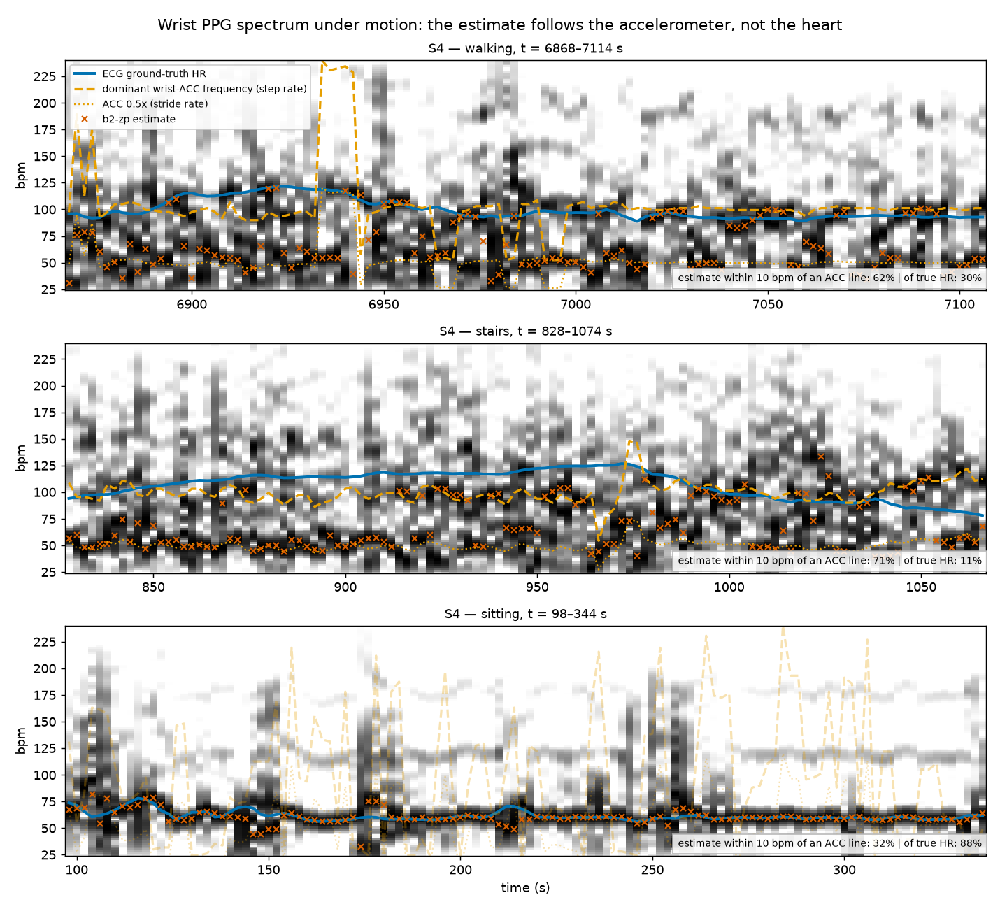
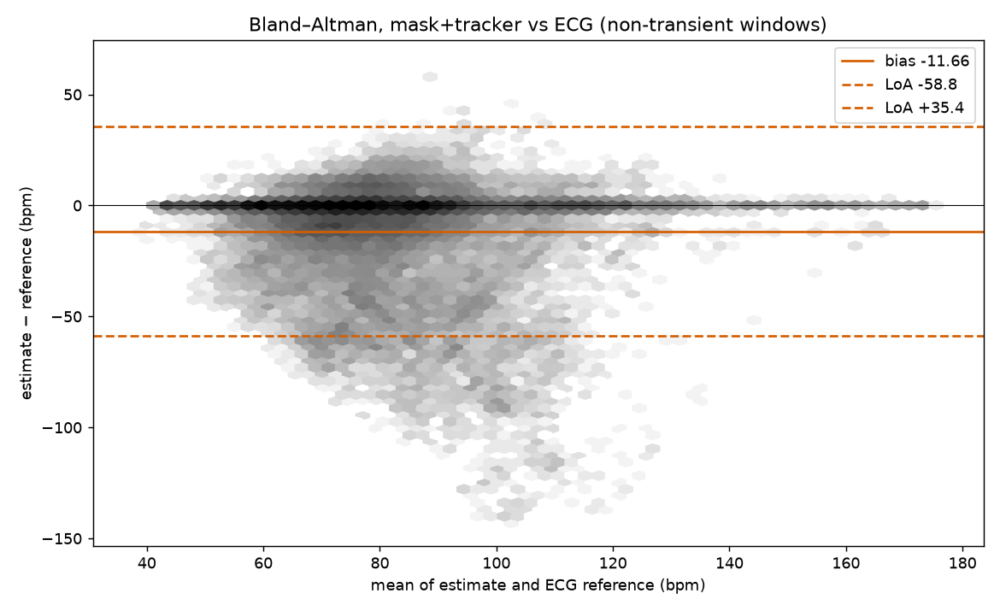

# wrist-ppg-motion-robust-hr

Heart-rate estimation from wrist PPG during real-world movement on PPG-DaLiA, evaluated leave-one-subject-out, per activity, against a published baseline computed the same way.

**Result.** Accelerometer-informed spectral masking plus peak tracking cuts error from **18.98 to 14.70 bpm** MAE over all 64,697 windows — a paired gain of **+4.27 bpm [95% CI +2.16, +6.98]**, improving 12 of 15 subjects. That **beats the published SpaMa baseline (15.56 bpm)** this reimplements, on the same dataset and protocol, with a tighter spread across subjects (fold SD 6.04 against their 7.5). SpaMaPlus reaches 11.06.

**Replacing the greedy tracker with fixed-lag Viterbi decoding gives 14.11 bpm at a 16-second latency** — statistically indistinguishable on MAE (+0.60 [−1.35, +2.36]) but improving **15 of 15 subjects** and halving the duration of error episodes. Full-session decoding, which is non-causal and not comparable to any published figure, reaches 12.97.

**Bland–Altman is the number a clinical reader should weigh.** Limits of agreement span **−58.8 to +35.4 bpm** and the bias is negative on every activity: this estimator **systematically under-reads**, which is what subharmonic and low-frequency lock predict. A 14.70 bpm MAE does not make it a measurement device.



*Band-passed wrist-PPG spectrum over the estimator's own 8 s windows for S4, with the ECG ground-truth heart rate (solid), the naive spectral-peak estimate (crosses) and the dominant wrist-accelerometer frequency with its stride subharmonic (dashed, dotted). During stairs the estimate sits on an accelerometer line in 71% of windows and on the true heart rate in 11%, while at rest it tracks the heart rate in 88% — the estimator follows the motion, not the heart. S4 was selected by rule: its stairs MAE is the closest of the 15 subjects to the cohort median.*

## Per activity, against the constant baseline

b0 is "always predict the mean training heart rate". Any method above that line has not solved that activity. Fold counts differ because S6 lacks lunch, walking and working.

| Activity | Folds | Windows | b0 constant | mask+tracker | fixed-lag Viterbi |
|---|---|---|---|---|---|
| sitting | 15 | 4,569 | 29.28 | **2.59** | **1.92** |
| stairs | 15 | 3,239 | 30.95 | 54.92 | 32.15 |
| table soccer | 15 | 2,310 | 14.02 | 27.42 | 28.29 |
| cycling | 15 | 3,473 | 33.74 | 36.57 | **22.57** |
| driving | 15 | 6,843 | 14.11 | **5.57** | **8.59** |
| lunch | 14 | 13,554 | 13.70 | **5.24** | **8.95** |
| walking | 14 | 4,697 | 15.46 | 24.75 | 27.41 |
| working | 14 | 8,497 | 17.02 | **4.66** | **5.12** |

Bold beats the constant. **Three activities still lose to it**: stairs, table soccer and walking. Viterbi nearly closes stairs (54.92 → 32.15 against 30.95) and fixes cycling outright, and moves the other two the wrong way.



**ANSI/CTA-2065**, the consumer wearable heart-rate standard, is reported in the literature as accepting a device at **MAPE ≤ 10%**. This method is at 14.3% pooled, so it fails — though it passes on sitting (4.2%), working (5.7%), lunch (6.4%) and driving (6.8%), and fails on every motion activity, worst on stairs at 45.2%. The standard's criterion is an aggregate error, so a device that is accurate on average while wrong for minutes at a time can pass it; the persistence result below is a gap in that criterion as much as in this method. (Criterion taken from peer-reviewed work citing the standard; CTA-2065-A itself is paywalled and was not read directly.)

## Six things this repository found

1. **A one-line physiological bound is worth +2.04 bpm and improves all 15 subjects** — as much as the entire signal-processing pipeline — but its gain vanishes 15 bpm below the cohort's own minimum heart rate, so it is a cohort ceiling, not a component.
2. **Masking eliminates the failure it targets and barely moves the error.** Accelerometer lock falls from 23.3% of error windows to 13.1%, the permutation-null chance rate, while total error falls 2.4%. The visible mechanism was not the binding constraint.
3. **The components are superadditive**: masking 0.36 bpm alone, tracking 1.45 alone, 3.18 together. Masking clears the competitor; tracking selects the survivor.
4. **Tracking trades error magnitude for error duration.** Mean error falls while individual errors last far longer — 61.7% of error time in runs over 30 s against the baseline's 27.6% — which for a wearable is the more dangerous failure. Viterbi halves the worst of it.
5. **In-fold hyperparameter selection costs 2.51 bpm** against choosing on all subjects, and only 7 of 15 folds pick the globally best setting. The global figures are never reported.
6. **The right answer is usually present and not selected.** Through masking, bounding and prediction tuning, the share of failed windows still containing the true peak rose from 58.8% to 65.7%. Viterbi is the first change to move it down, to 54.6%.

## Method positioning

In Charlton's taxonomy of wearable heart-rate algorithms this is **reference-based artifact cancellation followed by tracking**: the accelerometer supplies a motion reference used to down-weight motion lines in the PPG spectrum, and a tracker or decoder then selects among the surviving candidates. **Detect-and-discard was attempted and abandoned** — a per-window signal-quality index was built and validated, and it turned out to predict error well at rest (AUROC 0.895) and not at all under motion, where its confidence interval includes chance on stairs, cycling and walking and sits *below* chance on table soccer. Gating on it would have discarded exactly the windows it cannot judge, so the reset rule reads the estimates rather than any quality score. Time-domain adaptive cancellation was implemented, then closed without evaluation on the evidence that the cardiac component survives motion rather than being destroyed by it.

## Limitations

- **Worse than a constant on three activities.** Stairs (32.15 vs b0's 30.95), table soccer (28.29 vs 14.02) and walking (27.41 vs 15.46).
- **Errors last longer than the baseline's.** 61.7% of error time sits in runs over 30 s against 27.6% for b2-zp, with a worst episode near 10 minutes. Viterbi improves stairs markedly but cohort-wide persistence stays flat.
- **Fitzpatrick 2–4 only** — one type-2 subject, eleven type-3, three type-4, and **no type V or VI at all**. Nothing here speaks to the melanin confound in optical heart rate, and the stratified table settles nothing.
- **BVP is manufacturer-processed** with the DC component removed, so perfusion index is unavailable as a quality signal.
- **Activity durations are imbalanced** — lunch is 13,554 windows against 2,310 for table soccer — and **transients are 27% of pooled windows**, so pooled figures are dominated by the quiet activities.
- **S6 is truncated** at 5,250 s and lacks lunch, walking and working, so the folds are not equivalent.
- **The accelerometer clips at ±2 g**, on 47.5% of table-soccer and 39.0% of cycling windows. The motion reference is least reliable where it is most needed.
- **No window function.** Spectra are untapered so the ablation isolates masking; a Hann taper leaves the headline unchanged but reattributes 2.34 bpm from masking to tracking ([docs/taper-comparison.md](docs/taper-comparison.md)).
- **The search bound does not transfer.** Derived per fold from the training minimum, it would be wrong for a bradycardic, athletic or beta-blocked population. Published comparisons exclude it.
- **Several components were designed after seeing test-set diagnostics.** Hyperparameters are chosen in-fold so the fitted quantities are clean, but the choice of what to build was not blind (D-041, D-049).
- **One dataset, one device, 15 subjects.** Nothing here supports a claim about generalisation.

## Reproduce

```bash
python -m venv .venv && source .venv/bin/activate
pip install -r requirements.txt
# obtain PPG-DaLiA first: see data/README.md
pytest                                 # 113 tests; 13 need the dataset and skip without it
python -m src.eval.report_baselines    # the three baselines plus b2-zp
python -m src.eval.stage4              # masking and tracking ablation (~4 min)
python -m src.eval.viterbi_eval        # Viterbi against the greedy tracker (~6 min)
python -m src.eval.diagnostics         # surviving-peak and error-persistence diagnostics
python -m src.eval.stage5              # strata, agreement, and the Stage 5 figures
PPG_TAPER=1 python -m src.eval.stage4  # the same pipeline with a Hann window
```

The first real-data run unpickles all 15 subjects (~23 GB) and builds a 3.5 GB cache in about 40 s; later runs read the cache.

## More detail

- [docs/pipeline.md](docs/pipeline.md) — the stages: data layer, windowing, preprocessing, baselines, masking, tracking, the search bound
- [docs/diagnostics.md](docs/diagnostics.md) — does the cardiac peak survive, and how long does an error last
- [docs/evaluation.md](docs/evaluation.md) — Bland–Altman and Pearson r per activity, Fitzpatrick strata, the published comparison
- [docs/viterbi-notes.md](docs/viterbi-notes.md) — what the HMM formulation assumes, and how it differs from Kalman and TROIKA
- [docs/taper-comparison.md](docs/taper-comparison.md) — the Hann taper, measured and not adopted
- [docs/s5-investigation.md](docs/s5-investigation.md) — why one subject is three times harder than the rest
- [docs/decisions.md](docs/decisions.md) — every design decision, its evidence, what was rejected, and the open items

## References

- Reiss, A., Indlekofer, I., Schmidt, P., & Van Laerhoven, K. (2019). Deep PPG: Large-scale heart rate estimation with convolutional neural networks. *Sensors*, 19(14), 3079.
- Reiss, A., et al. (2019). PPG-DaLiA [Dataset]. UCI Machine Learning Repository. https://doi.org/10.24432/C53890
- Zhang, Z., Pi, Z., & Liu, B. (2015). TROIKA: A general framework for heart rate monitoring using wrist-type photoplethysmographic signals during intensive physical exercise. *IEEE Transactions on Biomedical Engineering*, 62(2), 522–531.
- Charlton, P. H., et al. (2022). Wearable photoplethysmography for cardiovascular monitoring. *Proceedings of the IEEE*, 110(3), 355–381.

## Licence

MIT (code). Data: CC BY 4.0, see [data/README.md](data/README.md).
