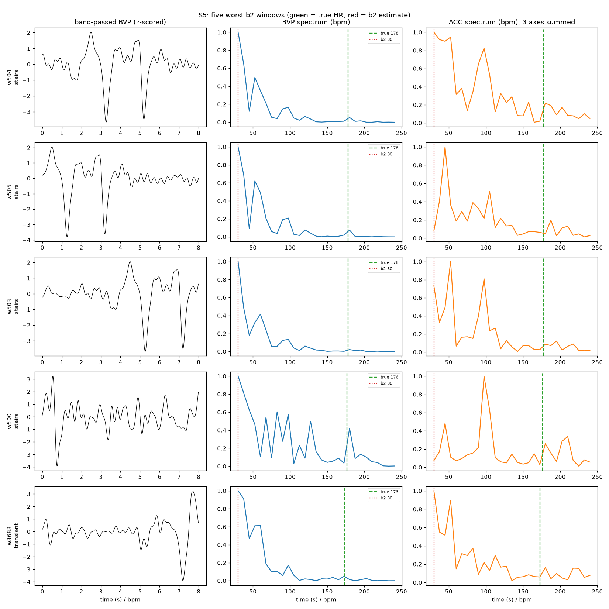

# S5: why b2 fails on this subject
Generated by `src/eval/investigate_s5.py`. S5 is not excluded from any result.

S5 has the worst b2 MAE of the cohort: 47.15 bpm, against 9.71 for S7. Fitzpatrick 3, age 21, self-reported fitness 4 - nothing unusual.

## 1. The labels and alignment are fine

S5's b1 oracle MAE is **0.94 bpm**, the *best* in the cohort (median 1.61, worst 2.02). If windows were misaligned or labels corrupted, the oracle would degrade too. It does not.

## 2. It is not resting signal quality

| metric | S5 (sitting) | cohort median | cohort range |
|---|---|---|---|
| BVP SD | 64.783 | 30.934 | 14.809-58.214 |
| BVP peak-to-peak | 293.450 | 169.794 | 90.441-268.012 |
| spectral concentration | 0.683 | 0.763 | 0.619-0.830 |
| beat-template r | 0.936 | 0.845 | 0.738-0.962 |
| combined SQI | 0.649 | 0.661 | 0.508-0.751 |
| out-of-band power | 0.075 | 0.046 | 0.018-0.123 |

S5's resting b2 MAE is **3.95 bpm** (cohort median 3.23). The sensor reads this subject normally when they are still.

## 3. The error is concentrated in motion, and in this subject's heart rate range

| activity | S5 b2 | S5 b2-zp | cohort median b2 | worst other | rank | S5 mean HR | cohort mean HR | windows |
|---|---|---|---|---|---|---|---|---|
| sitting | **3.95** | 2.40 | 3.23 | 8.72 | 6/15 | 93 | 59 | 300 |
| stairs | **67.91** | 69.27 | 36.76 | 69.23 | 2/15 | 161 | 116 | 232 |
| table soccer | **79.20** | 79.58 | 26.33 | 70.47 | 1/15 | 134 | 88 | 144 |
| cycling | **89.89** | 93.52 | 23.19 | 62.29 | 1/15 | 164 | 121 | 215 |
| driving | **50.30** | 47.49 | 12.11 | 21.22 | 1/15 | 119 | 82 | 415 |
| lunch | **37.32** | 35.30 | 15.74 | 21.53 | 1/15 | 117 | 81 | 1127 |
| walking | **56.48** | 54.74 | 22.07 | 57.02 | 2/15 | 135 | 97 | 295 |
| working | **31.92** | 28.73 | 6.17 | 16.62 | 1/15 | 110 | 74 | 634 |

S5's heart rate is unusually high: mean **125.8 bpm** (cohort mean 86.6), median 121.9, and 54.0% of windows above 120 bpm (cohort 7.7%). A high true HR sits further from the walking and cycling cadence band, so when the argmax locks onto motion the error is larger in bpm than it would be for a subject whose HR sits near their cadence.

This is why relative error is milder: S5's b2 MAPE is 35.8%, against a cohort median of 19.1% and a worst-other of 28.8%. Still the worst subject, but not the extreme outlier the bpm figure suggests.

## 3b. The failure mode is cohort-wide; only its cost is specific to this subject

When motion destroys the cardiac peak, the argmax often lands near the bottom of the 0.4-4 Hz band. S5 produces an estimate at or below 45 bpm in **27.8%** of windows - high, but within the cohort's range (median 16.1%, worst other 30.5%). What differs is the consequence: in 17.0% of S5's windows such an estimate coincides with a true HR of 120 bpm or more, so a single locked window contributes a ~100 bpm error rather than a ~30 bpm one.

## 4. The five worst windows

| window | activity | true HR | b2 | error | ACC clip fraction |
|---|---|---|---|---|---|
| 504 | stairs | 177.8 | 30.0 | -147.8 | 0.00% |
| 505 | stairs | 177.8 | 30.0 | -147.8 | 0.00% |
| 503 | stairs | 177.8 | 30.0 | -147.8 | 0.00% |
| 500 | stairs | 176.3 | 30.0 | -146.3 | 0.00% |
| 3683 | transient | 172.9 | 30.0 | -142.9 | 0.00% |

## Conclusion

S5 is not a bad recording. The oracle is the best in the cohort, resting b2 accuracy is ordinary, and the BVP amplitude is roughly twice the cohort median, so sensor contact is good. What sets S5 apart is heart rate: elevated in **every** activity, including sitting, and above 120 bpm in 54% of windows against 7.7% for everyone else. The spectral-peak failure mode - locking onto low-frequency motion energy when the cardiac peak is buried - is cohort-wide, but a true HR near 160 turns each locked window into a ~130 bpm error instead of a ~40 bpm one. That also explains why the gap narrows under relative error.

One consequence for later stages: S5 is bad on quiet activities too (working 31.92 bpm against a cohort median of 6.17), which is not explained by motion intensity alone and is worth revisiting once ACC-referenced masking exists. The fix is motion handling in Stage 4, not exclusion - and S5 is the subject that will show whether it works.
